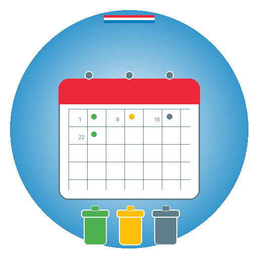

<div align="center">
  
  
  # Waste Calendar Extractor for Niederanven, Luxembourg 🇱🇺
</div>

[](https://github.com/sgrimee/waste-calendar-extractor/actions/workflows/ci.yml)
[](https://opensource.org/licenses/MIT)
[](https://www.python.org/downloads/)

**Ready-to-use waste collection calendar for the Commune of Niederanven, Luxembourg**

## 📅 Quick Start: Use the Calendar Directly

**No installation needed!** Simply import the ready-to-use calendar into your calendar app:

### Calendar Links (iCal format)

**Stable URL (always current year):**
```
https://raw.githubusercontent.com/sgrimee/waste-calendar-extractor/main/waste.ics
```

**Specific year:**
```
https://raw.githubusercontent.com/sgrimee/waste-calendar-extractor/main/waste-2025.ics
```

### How to Import:
- **Google Calendar**: Settings → Import & Export → Import → Select file or paste URL
- **Apple Calendar**: File → Import → Select file or paste URL  
- **Outlook**: File → Open & Export → Import/Export → Select file
- **Other apps**: Look for "Import Calendar" or "Subscribe to Calendar" and use the URL above

The calendar includes all waste collection dates for 2025 with multilingual descriptions.

**💡 Pro tip:** Subscribe to the stable URL in your calendar app for automatic updates when new calendars are published!

---

## Wéi de Kalenner importéieren / Kalender importieren / Comment importer le calendrier

### 🇱🇺 **Lëtzebuergesch**
Fir den Offall-Kalenner an Ärem Telefon ze kréien:
1. Kopéiert dësen Link: `https://raw.githubusercontent.com/sgrimee/waste-calendar-extractor/main/waste.ics`
2. Gitt an Är Kalenner-App (Google Calendar, Apple Calendar, etc.)
3. Sicht no "Kalenner importéieren" oder "Kalenner abonnéieren"
4. Fügt den Link an - Är Telefon gëtt automatesch all d'Offall-Datumer!

### 🇩🇪 **Deutsch**
So bekommen Sie den Müllkalender auf Ihr Handy:
1. Kopieren Sie diesen Link: `https://raw.githubusercontent.com/sgrimee/waste-calendar-extractor/main/waste.ics`
2. Öffnen Sie Ihre Kalender-App (Google Kalender, Apple Kalender, etc.)
3. Suchen Sie nach "Kalender importieren" oder "Kalender abonnieren"
4. Fügen Sie den Link hinzu - Ihr Handy bekommt automatisch alle Mülltermine!

### 🇫🇷 **Français**
Pour avoir le calendrier des déchets sur votre téléphone :
1. Copiez ce lien : `https://raw.githubusercontent.com/sgrimee/waste-calendar-extractor/main/waste.ics`
2. Ouvrez votre app calendrier (Google Calendar, Apple Calendar, etc.)
3. Cherchez "Importer calendrier" ou "S'abonner au calendrier"
4. Ajoutez le lien - votre téléphone recevra automatiquement toutes les dates de collecte !

---

## About This Tool

A Python tool to extract waste collection dates from PDF calendars published by the **Commune of Niederanven** and generate iCal files for easy calendar integration.

## Source Data

This tool extracts data from the official waste collection calendar published by the **Commune of Niederanven**. 

The original PDF calendar ("Ressourcekalenner") can be found on the [official Niederanven website](https://www.niederanven.lu/en/environment/waste-disposal-management). Visit their waste management section for the latest calendar updates.

## Features

- 📅 Extracts dates and collection types from PDF waste collection calendars
- 🇱🇺 Supports Luxembourgish month names and multilingual waste descriptions  
- 📁 Generates iCal (.ics) files for calendar import
- 🔍 Real-time logging shows extraction progress
- 🧪 Comprehensive unit tests
- 📦 Modular, well-documented code

## Installation

### Using uv (recommended)

```bash
git clone https://github.com/yourusername/waste-calendar-extractor.git
cd waste-calendar-extractor
uv sync
```

### Using pip

```bash
git clone https://github.com/yourusername/waste-calendar-extractor.git
cd waste-calendar-extractor
pip install -e .
```

## Usage

### Basic usage

```bash
# Extract from default PDF file
uv run python extract_dates_from_pdf.py

# Or if installed as package
extract-waste-dates
```

### Advanced usage

```bash
# Specify custom PDF file
uv run python extract_dates_from_pdf.py my-calendar.pdf

# Custom output file and year
uv run python extract_dates_from_pdf.py -o my-calendar.ics -y 2026

# Verbose logging
uv run python extract_dates_from_pdf.py -v

# Show help
uv run python extract_dates_from_pdf.py --help
```

## Command Line Options

- `pdf_file`: Path to PDF file (default: `ressourcekalenner-nidderaanwen-web.pdf`)
- `-o, --output`: Output iCal file path (default: `waste-{year}.ics`)
- `-y, --year`: Year for the calendar (default: 2025)
- `-v, --verbose`: Enable verbose logging

## Supported Waste Types

The extractor recognizes various waste collection types in multiple languages:

- **Residual waste** (Reschtoffäll, Déchets ménagers)
- **Paper & Carton** (Pabeier a Kartong, Papier et carton)
- **Glass** (Glas, Verre)
- **Packaging** (Verpackungen, Emballages, VALORLUX)
- **Organic waste** (Organesch Ressourcen, Ressources organiques)
- **Old clothes** (Aalt Gezei, Vieux vêtements)
- **Christmas trees** (Beemercher, Sapins de Noël)

## Development

This project uses [just](https://github.com/casey/just) for development commands:

```bash
# Install development dependencies
just install

# Run all tests
just test

# Run all checks (format, lint, type check)
just check

# Format code and fix issues
just format

# Lint code
just lint  

# Type check with mypy
just typecheck

# Build package
just build

# Generate calendar for current year
just generate

# Generate calendar for specific year
just generate-year 2026
```

### Manual testing (without just)

```bash
# Run tests
PYTHONPATH=src uv run python -m pytest tests/ -v

# Run checks
uv run ruff check src/ tests/
PYTHONPATH=src uv run mypy src/ tests/
```

### Project structure

```
waste-calendar-extractor/
├── src/
│   └── waste_calendar_extractor/
│       ├── __init__.py        # Main extraction module
│       └── py.typed           # Type checking marker
├── tests/
│   └── test_extract_dates.py  # Unit tests
├── icons/
│   └── icon.png              # Project icon
├── justfile                  # Development commands
├── pyproject.toml            # Project configuration
├── README.md                 # This file
├── LICENSE                   # MIT license
└── waste-2025.ics           # Ready-to-use calendar file
```

## How it works

1. **PDF Analysis**: Uses PyMuPDF to extract positioned text elements from each page
2. **Month Detection**: Identifies Luxembourgish month names to track calendar progression
3. **Row Grouping**: Groups text elements by Y-coordinate to identify calendar rows
4. **Pattern Matching**: Matches dates (1-31) with waste type keywords in the same row
5. **iCal Generation**: Creates calendar events using the `ics` library

## Requirements

- Python >=3.11
- PyMuPDF for PDF processing
- ics for calendar generation

## License

MIT License - see [LICENSE](LICENSE) file for details.

## Contributing

1. Fork the repository
2. Create a feature branch (`git checkout -b feature/amazing-feature`)
3. Commit your changes (`git commit -m 'Add some amazing feature'`)
4. Push to the branch (`git push origin feature/amazing-feature`)
5. Open a Pull Request